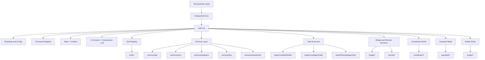

# Claude Code Repository Structure Map

This document is a quick orientation guide to the `claude-code` repo.

## High-Level Module Tree

```text
claude-code/
├─ main.tsx                      # Main runtime orchestrator and bootstrap
├─ entrypoints/                  # Startup entry adapters (cli, mcp, sdk)
├─ cli/                          # CLI handlers + transport clients
├─ commands/ + commands.ts       # Command implementations + registry
├─ tools/ + tools.ts             # Tool registry and tool implementations
├─ services/                     # API, analytics, mcp, lsp, memory, orchestration
├─ tasks/                        # Task executors (local/remote/agent/dream)
├─ screens/                      # Top-level terminal UI screens
├─ components/                   # Reusable terminal UI components
├─ ink/                          # Rendering primitives/utilities
├─ state/                        # App state store/selectors/update pipeline
├─ context/                      # React context providers
├─ bridge/                       # Bridge mode session and messaging
├─ remote/                       # Remote session manager and bridges
├─ coordinator/                  # Multi-agent coordinator mode
├─ memdir/                       # Memory indexing and retrieval helpers
├─ keybindings/                  # Shortcut parsing/validation/resolution
├─ migrations/                   # Config/model migration scripts
├─ plugins/                      # Plugin initialization and lifecycle hooks
├─ skills/                       # Skill loading and bundled skills
├─ server/                       # Direct-connect session server pieces
├─ upstreamproxy/                # Upstream proxy/relay logic
├─ assistant/                    # Assistant-mode gated features
├─ buddy/                        # Companion-feature gated code
├─ constants/                    # Prompt/constants/betas/limits definitions
├─ utils/                        # Shared utility layer
└─ types/ + schemas/             # Shared type/schema definitions
```

## Architecture Diagram



## Suggested Reading Order

1. `main.tsx` (global control plane)
2. `entrypoints/cli.tsx` and `commands.ts` (startup + command routing)
3. `tools.ts` and `tools/` (capability surface)
4. `services/` + `tasks/` (execution behavior)
5. `screens/`, `components/`, `ink/` (presentation layer)
